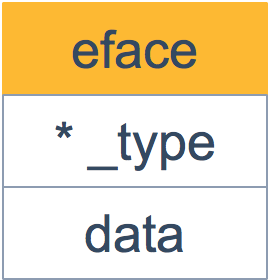
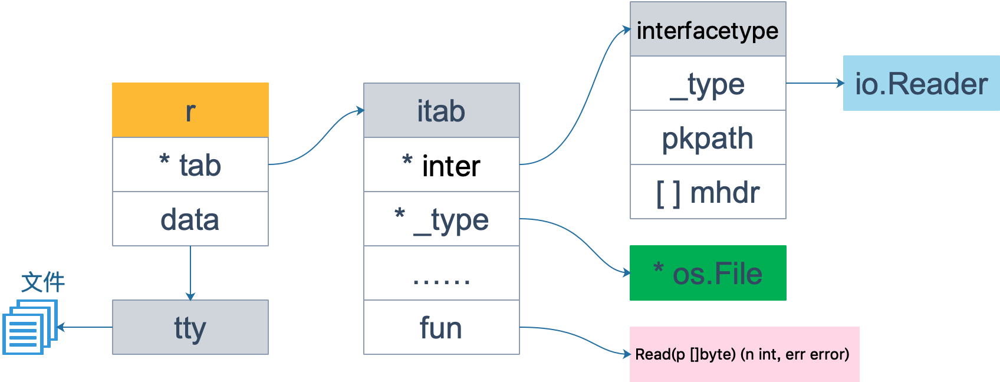
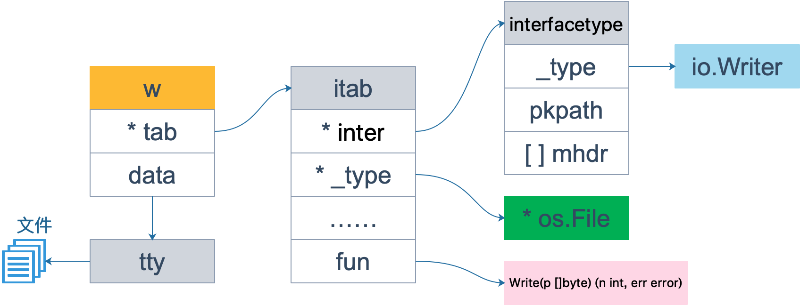
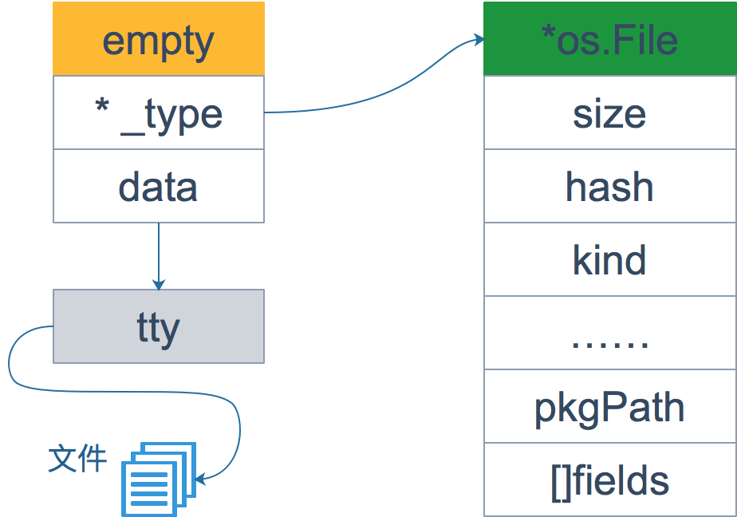
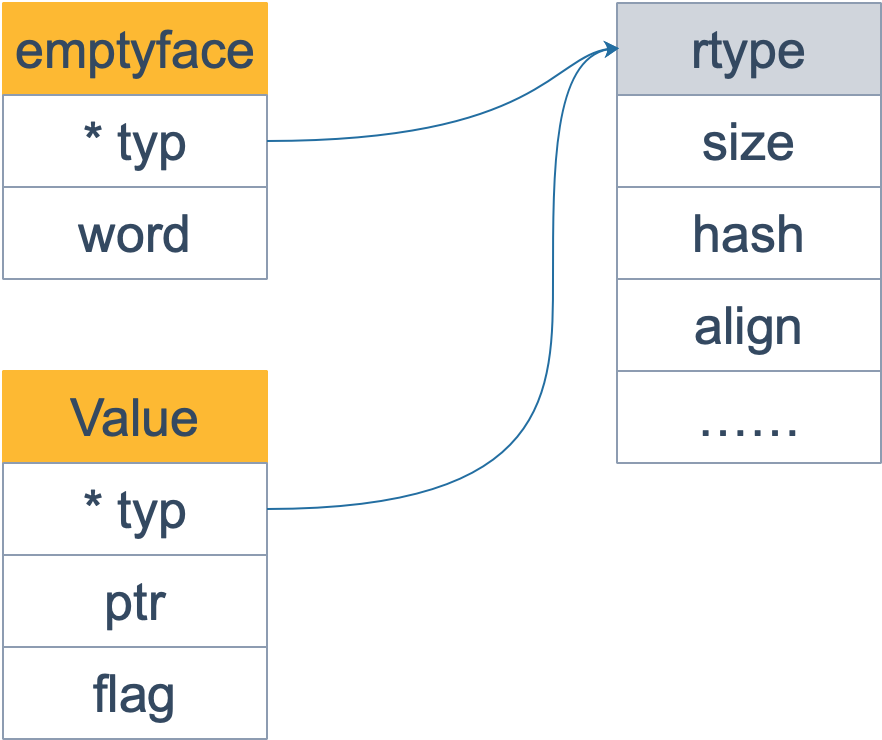

`interface`，它是 Go 语言实现抽象的一个非常强大的工具。当向接口变量赋予一个实体类型的时候，接口会存储实体的类型信息，反射就是通过接口的类型信息实现的，反射建立在类型的基础上。

Go 语言在 reflect 包里定义了各种类型，实现了反射的各种函数，通过它们可以在运行时检测类型的信息、改变类型的值。

# types 和 interface
Go 语言中，每个变量都有一个静态类型，在编译阶段就确定了的，比如 `int, float64, []int` 等等。注意，这个类型是声明时候的类型，不是底层数据类型。

Go 官方博客里就举了一个例子：

```golang
type MyInt int

var i int
var j MyInt
```

尽管 i，j 的底层类型都是 int，但我们知道，他们是不同的静态类型，除非进行类型转换，否则，i 和 j 不能同时出现在等号两侧。j 的静态类型就是 `MyInt`。

反射主要与 interface{} 类型相关。关于 interface 的底层结构，可以参考前面有关 interface 章节的内容，这里复习一下。

```golang
type iface struct {
	tab  *itab
	data unsafe.Pointer
}

type itab struct {
	inter  *interfacetype
	_type  *_type
	link   *itab
	hash   uint32
	bad    bool
	inhash bool
	unused [2]byte
	fun    [1]uintptr
}
```

其中 `itab` 由具体类型 `_type` 以及 `interfacetype` 组成。`_type` 表示具体类型，而 `interfacetype` 则表示具体类型实现的接口类型。


实际上，iface 描述的是非空接口，它包含方法；与之相对的是 `eface`，描述的是空接口，不包含任何方法，Go 语言里有的类型都 `“实现了”` 空接口。

```golang
type eface struct {
    _type *_type
    data  unsafe.Pointer
}
```

相比 `iface`，`eface` 就比较简单了。只维护了一个 `_type` 字段，表示空接口所承载的具体的实体类型。`data` 描述了具体的值。



还是用 Go 官方关于反射的博客里的例子，当然，我会用图形来详细解释，结合两者来看会更清楚。顺便提一下，搞技术的不要害怕英文资料，要想成为技术专家，读英文原始资料是技术提高的一条必经之路。

先明确一点：接口变量可以存储任何实现了接口定义的所有方法的变量。

Go 语言中最常见的就是 `Reader` 和 `Writer` 接口：

```golang
type Reader interface {
    Read(p []byte) (n int, err error)
}

type Writer interface {
    Write(p []byte) (n int, err error)
}
```

接下来，就是接口之间的各种转换和赋值了：

```golang
var r io.Reader
tty, err := os.OpenFile("/Users/qcrao/Desktop/test", os.O_RDWR, 0)
if err != nil {
    return nil, err
}
r = tty
```

首先声明 `r` 的类型是 `io.Reader`，注意，这是 `r` 的静态类型，此时它的动态类型为 `nil`，并且它的动态值也是 `nil`。

之后，`r = tty` 这一语句，将 `r` 的动态类型变成 `*os.File`，动态值则变成非空，表示打开的文件对象。这时，r 可以用`<value, type>`对来表示为： `<tty, *os.File>`。



注意看上图，此时虽然 `fun` 所指向的函数只有一个 `Read` 函数，其实 `*os.File` 还包含 `Write` 函数，也就是说 `*os.File` 其实还实现了 `io.Writer` 接口。因此下面的断言语句可以执行：

```golang
var w io.Writer
w = r.(io.Writer)
```

之所以用断言，而不能直接赋值，是因为 `r` 的静态类型是 `io.Reader`，并没有实现 `io.Writer` 接口。断言能否成功，看 `r` 的动态类型是否符合要求。

这样，w 也可以表示成 `<tty, *os.File>`，仅管它和 `r` 一样，但是 w 可调用的函数取决于它的静态类型 `io.Writer`，也就是说它只能有这样的调用形式： `w.Write()` 。`w` 的内存形式如下图：



和 `r` 相比，仅仅是 `fun` 对应的函数变了：`Read -> Write`。

最后，再来一个赋值：

```golang
var empty interface{}
empty = w
```

由于 `empty` 是一个空接口，因此所有的类型都实现了它，w 可以直接赋给它，不需要执行断言操作。


从上面的三张图可以看到，interface 包含三部分信息：`_type` 是类型信息，`*data` 指向实际类型的实际值，`itab` 包含实际类型的信息，包括大小、包路径，还包含绑定在类型上的各种方法（图上没有画出方法），补充一下关于 os.File 结构体的图：



这一节的最后，展示一个技巧：

先参考源码，分别定义一个`“伪装”`的 iface 和 eface 结构体。

```golang
type iface struct {
	tab  *itab
	data unsafe.Pointer
}
type itab struct {
	inter uintptr
	_type uintptr
	link uintptr
	hash  uint32
	_     [4]byte
	fun   [1]uintptr
}

type eface struct {
	_type uintptr
	data unsafe.Pointer
}
```

接着，将接口变量占据的内存内容强制解释成上面定义的类型，再打印出来：

```golang
package main

import (
	"os"
	"fmt"
	"io"
	"unsafe"
)

func main() {
	var r io.Reader
	fmt.Printf("initial r: %T, %v\n", r, r)

	tty, _ := os.OpenFile("/Users/qcrao/Desktop/test", os.O_RDWR, 0)
	fmt.Printf("tty: %T, %v\n", tty, tty)

	// 给 r 赋值
	r = tty
	fmt.Printf("r: %T, %v\n", r, r)

	rIface := (*iface)(unsafe.Pointer(&r))
	fmt.Printf("r: iface.tab._type = %#x, iface.data = %#x\n", rIface.tab._type, rIface.data)

	// 给 w 赋值
	var w io.Writer
	w = r.(io.Writer)
	fmt.Printf("w: %T, %v\n", w, w)

	wIface := (*iface)(unsafe.Pointer(&w))
	fmt.Printf("w: iface.tab._type = %#x, iface.data = %#x\n", wIface.tab._type, wIface.data)

	// 给 empty 赋值
	var empty interface{}
	empty = w
	fmt.Printf("empty: %T, %v\n", empty, empty)

	emptyEface := (*eface)(unsafe.Pointer(&empty))
	fmt.Printf("empty: eface._type = %#x, eface.data = %#x\n", emptyEface._type, emptyEface.data)
}
```

运行结果：

```golang
initial r: <nil>, <nil>
tty: *os.File, &{0xc4200820f0}
r: *os.File, &{0xc4200820f0}
r: iface.tab._type = 0x10bfcc0, iface.data = 0xc420080020
w: *os.File, &{0xc4200820f0}
w: iface.tab._type = 0x10bfcc0, iface.data = 0xc420080020
empty: *os.File, &{0xc4200820f0}
empty: eface._type = 0x10bfcc0, eface.data = 0xc420080020
```

`r，w，empty` 的动态类型和动态值都一样。不再详细解释了，结合前面的图可以看得非常清晰。

# 反射的基本函数
reflect 包里定义了一个接口和一个结构体，即 `reflect.Type` 和 `reflect.Value`，它们提供很多函数来获取存储在接口里的类型信息。

`reflect.Type` 主要提供关于类型相关的信息，所以它和 `_type` 关联比较紧密；`reflect.Value` 则结合 `_type` 和 `data` 两者，因此程序员可以获取甚至改变类型的值。

reflect 包中提供了两个基础的关于反射的函数来获取上述的接口和结构体：

```golang
func TypeOf(i interface{}) Type 
func ValueOf(i interface{}) Value
```

`TypeOf` 函数用来提取一个接口中值的类型信息。由于它的输入参数是一个空的 `interface{}`，调用此函数时，实参会先被转化为 `interface{}`类型。这样，实参的类型信息、方法集、值信息都存储到 `interface{}` 变量里了。

看下源码：

```golang
func TypeOf(i interface{}) Type {
	eface := *(*emptyInterface)(unsafe.Pointer(&i))
	return toType(eface.typ)
}
```

这里的 `emptyInterface` 和上面提到的 `eface` 是一回事（字段名略有差异，字段是相同的），并且在不同的源码包：前者在 `reflect` 包，后者在 `runtime` 包。 `eface.typ` 就是动态类型。

```golang
type emptyInterface struct {
	typ  *rtype
	word unsafe.Pointer
}
```

至于 `toType` 函数，只是做了一个类型转换：

```golang
func toType(t *rtype) Type {
	if t == nil {
		return nil
	}
	return t
}
```

注意，返回值 `Type` 实际上是一个接口，定义了很多方法，用来获取类型相关的各种信息，而 `*rtype` 实现了 `Type` 接口。

```golang
type Type interface {
    // 所有的类型都可以调用下面这些函数

	// 此类型的变量对齐后所占用的字节数
	Align() int
	
	// 如果是 struct 的字段，对齐后占用的字节数
	FieldAlign() int

	// 返回类型方法集里的第 `i` (传入的参数)个方法
	Method(int) Method

	// 通过名称获取方法
	MethodByName(string) (Method, bool)

	// 获取类型方法集里导出的方法个数
	NumMethod() int

	// 类型名称
	Name() string

	// 返回类型所在的路径，如：encoding/base64
	PkgPath() string

	// 返回类型的大小，和 unsafe.Sizeof 功能类似
	Size() uintptr

	// 返回类型的字符串表示形式
	String() string

	// 返回类型的类型值
	Kind() Kind

	// 类型是否实现了接口 u
	Implements(u Type) bool

	// 是否可以赋值给 u
	AssignableTo(u Type) bool

	// 是否可以类型转换成 u
	ConvertibleTo(u Type) bool

	// 类型是否可以比较
	Comparable() bool

	// 下面这些函数只有特定类型可以调用
	// 如：Key, Elem 两个方法就只能是 Map 类型才能调用
	
	// 类型所占据的位数
	Bits() int

	// 返回通道的方向，只能是 chan 类型调用
	ChanDir() ChanDir

	// 返回类型是否是可变参数，只能是 func 类型调用
	// 比如 t 是类型 func(x int, y ... float64)
	// 那么 t.IsVariadic() == true
	IsVariadic() bool

	// 返回内部子元素类型，只能由类型 Array, Chan, Map, Ptr, or Slice 调用
	Elem() Type

	// 返回结构体类型的第 i 个字段，只能是结构体类型调用
	// 如果 i 超过了总字段数，就会 panic
	Field(i int) StructField

	// 返回嵌套的结构体的字段
	FieldByIndex(index []int) StructField

	// 通过字段名称获取字段
	FieldByName(name string) (StructField, bool)

	// FieldByNameFunc returns the struct field with a name
	// 返回名称符合 func 函数的字段
	FieldByNameFunc(match func(string) bool) (StructField, bool)

	// 获取函数类型的第 i 个参数的类型
	In(i int) Type

	// 返回 map 的 key 类型，只能由类型 map 调用
	Key() Type

	// 返回 Array 的长度，只能由类型 Array 调用
	Len() int

	// 返回类型字段的数量，只能由类型 Struct 调用
	NumField() int

	// 返回函数类型的输入参数个数
	NumIn() int

	// 返回函数类型的返回值个数
	NumOut() int

	// 返回函数类型的第 i 个值的类型
	Out(i int) Type

    // 返回类型结构体的相同部分
	common() *rtype
	
	// 返回类型结构体的不同部分
	uncommon() *uncommonType
}
```

可见 `Type` 定义了非常多的方法，通过它们可以获取类型的一切信息，大家一定要完整的过一遍上面所有的方法。

注意到 `Type` 方法集的倒数第二个方法 `common`
 返回的 `rtype`类型，它和上一篇文章讲到的 `_type` 是一回事，而且源代码里也注释了：两边要保持同步：
 
```golang
 // rtype must be kept in sync with ../runtime/type.go:/^type._type.
```

```golang
type rtype struct {
	size       uintptr
	ptrdata    uintptr
	hash       uint32
	tflag      tflag
	align      uint8
	fieldAlign uint8
	kind       uint8
	alg        *typeAlg
	gcdata     *byte
	str        nameOff
	ptrToThis  typeOff
}
```
 
所有的类型都会包含 `rtype` 这个字段，表示各种类型的公共信息；另外，不同类型包含自己的一些独特的部分。

比如下面的 `arrayType` 和 `chanType` 都包含 `rytpe`，而前者还包含 slice，len 等和数组相关的信息；后者则包含 `dir` 表示通道方向的信息。

```golang
// arrayType represents a fixed array type.
type arrayType struct {
	rtype `reflect:"array"`
	elem  *rtype // array element type
	slice *rtype // slice type
	len   uintptr
}

// chanType represents a channel type.
type chanType struct {
	rtype `reflect:"chan"`
	elem  *rtype  // channel element type
	dir   uintptr // channel direction (ChanDir)
}
```

注意到，`Type` 接口实现了 `String()` 函数，满足 `fmt.Stringer` 接口，因此使用 `fmt.Println` 打印的时候，输出的是 `String()` 的结果。另外，`fmt.Printf()` 函数，如果使用 `%T` 来作为格式参数，输出的是 `reflect.TypeOf` 的结果，也就是动态类型。例如：

```golang
fmt.Printf("%T", 3) // int
```

---

讲完了 `TypeOf` 函数，再来看一下 `ValueOf` 函数。返回值 `reflect.Value` 表示 `interface{}` 里存储的实际变量，它能提供实际变量的各种信息。相关的方法常常是需要结合类型信息和值信息。例如，如果要提取一个结构体的字段信息，那就需要用到 _type (具体到这里是指 structType) 类型持有的关于结构体的字段信息、偏移信息，以及 `*data` 所指向的内容 —— 结构体的实际值。

源码如下：

```golang
func ValueOf(i interface{}) Value {
	if i == nil {
		return Value{}
	}
	
   // ……
	return unpackEface(i)
}

// 分解 eface
func unpackEface(i interface{}) Value {
	e := (*emptyInterface)(unsafe.Pointer(&i))

	t := e.typ
	if t == nil {
		return Value{}
	}
	
	f := flag(t.Kind())
	if ifaceIndir(t) {
		f |= flagIndir
	}
	return Value{t, e.word, f}
}
```

从源码看，比较简单：将先将 `i` 转换成 `*emptyInterface` 类型， 再将它的 `typ` 字段和 `word` 字段以及一个标志位字段组装成一个 `Value` 结构体，而这就是 `ValueOf` 函数的返回值，它包含类型结构体指针、真实数据的地址、标志位。

Value 结构体定义了很多方法，通过这些方法可以直接操作 Value 字段 ptr 所指向的实际数据：

```golang
// 设置切片的 len 字段，如果类型不是切片，就会panic
 func (v Value) SetLen(n int)
 
 // 设置切片的 cap 字段
 func (v Value) SetCap(n int)
 
 // 设置字典的 kv
 func (v Value) SetMapIndex(key, val Value)

 // 返回切片、字符串、数组的索引 i 处的值
 func (v Value) Index(i int) Value
 
 // 根据名称获取结构体的内部字段值
 func (v Value) FieldByName(name string) Value
 
 // ……
```

`Value` 字段还有很多其他的方法。例如：

```golang
// 用来获取 int 类型的值
func (v Value) Int() int64

// 用来获取结构体字段（成员）数量
func (v Value) NumField() int

// 尝试向通道发送数据（不会阻塞）
func (v Value) TrySend(x reflect.Value) bool

// 通过参数列表 in 调用 v 值所代表的函数（或方法
func (v Value) Call(in []Value) (r []Value) 

// 调用变参长度可变的函数
func (v Value) CallSlice(in []Value) []Value 
```

不一一列举了，反正是非常多。可以去 `src/reflect/value.go` 去看看源码，搜索 `func (v Value)` 就能看到。

另外，通过 `Type()` 方法和 `Interface()` 方法可以打通 `interface`、`Type`、`Value` 三者。Type() 方法也可以返回变量的类型信息，与 reflect.TypeOf() 函数等价。Interface() 方法可以将 Value 还原成原来的 interface。


总结一下：`TypeOf()` 函数返回一个接口，这个接口定义了一系列方法，利用这些方法可以获取关于类型的所有信息； `ValueOf()` 函数返回一个结构体变量，包含类型信息以及实际值。

用一张图来串一下：



上图中，`rtye` 实现了 `Type` 接口，是所有类型的公共部分。emptyface 结构体和 eface 其实是一个东西，而 rtype 其实和 _type 是一个东西，只是一些字段稍微有点差别，比如 emptyface 的 word 字段和 eface 的 data 字段名称不同，但是数据型是一样的。

# 反射的三大定律
根据 Go 官方关于反射的博客，反射有三大定律：

>1. Reflection goes from interface value to reflection object.

>2. Reflection goes from reflection object to interface value.

>3. To modify a reflection object, the value must be settable.

第一条是最基本的：反射是一种检测存储在 `interface` 中的类型和值机制。这可以通过 `TypeOf` 函数和 `ValueOf` 函数得到。

第二条实际上和第一条是相反的机制，它将 `ValueOf` 的返回值通过 `Interface()` 函数反向转变成 `interface` 变量。

前两条就是说 `接口型变量` 和 `反射类型对象` 可以相互转化，反射类型对象实际上就是指的前面说的 `reflect.Type` 和 `reflect.Value`。

第三条不太好懂：如果需要操作一个反射变量，那么它必须是可设置的。反射变量可设置的本质是它存储了原变量本身，这样对反射变量的操作，就会反映到原变量本身；反之，如果反射变量不能代表原变量，那么操作了反射变量，不会对原变量产生任何影响，这会给使用者带来疑惑。所以第二种情况在语言层面是不被允许的。

举一个经典例子：

```golang
var x float64 = 3.4
v := reflect.ValueOf(x)
v.SetFloat(7.1) // Error: will panic.
```

执行上面的代码会产生 panic，原因是反射变量 `v` 不能代表 `x` 本身，为什么？因为调用 `reflect.ValueOf(x)` 这一行代码的时候，传入的参数在函数内部只是一个拷贝，是值传递，所以 `v` 代表的只是 `x` 的一个拷贝，因此对 `v` 进行操作是被禁止的。

可设置是反射变量 `Value` 的一个性质，但不是所有的 `Value` 都是可被设置的。

就像在一般的函数里那样，当我们想改变传入的变量时，使用指针就可以解决了。

```golang
var x float64 = 3.4
p := reflect.ValueOf(&x)
fmt.Println("type of p:", p.Type())
fmt.Println("settability of p:", p.CanSet())
```

输出是这样的：

```golang
type of p: *float64
settability of p: false
```

`p` 还不是代表 `x`，`p.Elem()` 才真正代表 `x`，这样就可以真正操作 `x` 了：

```golang
v := p.Elem()
v.SetFloat(7.1)
fmt.Println(v.Interface()) // 7.1
fmt.Println(x) // 7.1
```

关于第三条，记住一句话：如果想要操作原变量，反射变量 `Value` 必须要 hold 住原变量的地址才行。